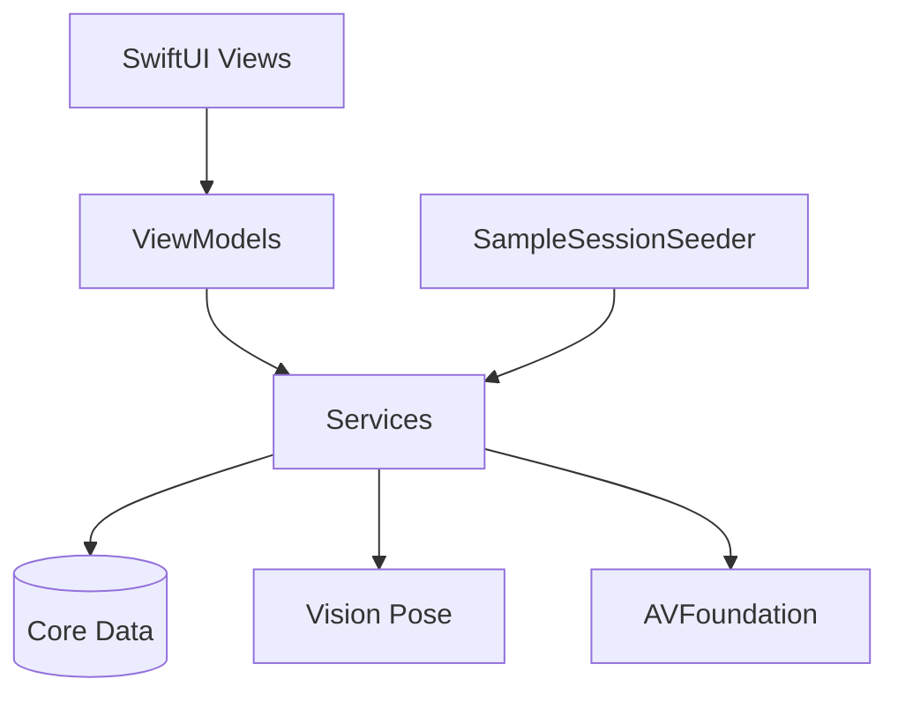

# Baseball Swing Analyzer

An iPhone app that records baseball swing sessions, detects individual swings with on-device pose tracking, and scores each swing against six biomechanics metrics.

## Features

- **Session recording** — Capture multiple swings in one continuous video (targets 120 fps with fast shutter via `CameraService`)
- **Automatic swing detection** — Vision body pose + velocity-based swing segmentation
- **Biomechanics scoring** — Composite score from six metrics:
  - Knee bend (degrees)
  - Hip rotation (degrees)
  - Hip horizontal movement (inches)
  - Hip vertical movement (inches)
  - Hip–shoulder alignment (percentage)
  - Time to contact (seconds)
- **Per-swing skeleton replay** — Slow-motion clip with pose overlay (`SwingSkeletonVideoView`)
- **Full-session playback** — Watch the raw recording (`VideoPlaybackView`)
- **Detection rerun** — Adjust sensitivity, expected swing count, and camera-angle weights; preview before replacing results (`SwingDetectionRerunView`)
- **Example sessions** — Bundled sample videos seed on launch with full analysis (`SampleSessionSeeder`)

## Requirements

- Xcode 15 or later
- iOS **16.0+** deployment target
- Physical iPhone for camera recording and pose detection (simulator is fine for UI-only work)
- Apple Developer account for on-device testing

## Quick start

```bash
open SwingAnalyzer/SwingAnalyzer.xcodeproj
```

1. Select your iPhone as the run destination.
2. Press **⌘R** to build and run.

## Sample example sessions

Three example `.mov` files ship with the app bundle for local development but are **not tracked in git** (see `.gitignore`).

**Required files** in `SwingAnalyzer/SwingAnalyzer/Resources/SampleVideos/`:

- `BP_000004.mov`
- `BP_002026.mov`
- `BP_002028.mov`

Copy these into that folder before building. Each clip contains multiple swings.

On launch, `SampleSessionSeeder`:

1. Removes legacy v1 sample sessions and their large video copies (if present).
2. Copies any missing bundle videos into `Documents/RecordedVideos/` as `sample_v2_*.mov`.
3. Runs the full pose-detection → swing-detection → scoring pipeline in the background.
4. Re-creates example sessions if the user deletes them.

First launch with sample videos may take 30–90 seconds while analysis completes; the session list refreshes as each sample finishes.

## Architecture

MVVM with service layer:



### Key services

| Service | Role |
|---------|------|
| `CameraService` | AVFoundation capture, 120 fps recording, live pose overlay |
| `PoseDetectionService` | Frame-by-frame body pose via Vision |
| `SwingDetectionService` | Velocity-based swing candidate detection and ranking |
| `BiomechanicsAnalyzer` | Per-swing metric calculation |
| `SampleSessionSeeder` | Bundle sample videos into Core Data on launch |
| `SwingAnalysisViewModel` | Orchestrates pose → detect → score → persist |

### Project layout

```
SwingAnalyzer/SwingAnalyzer/
├── App/                    # Entry point, ContentView
├── Models/
│   ├── CoreData/           # Session, Swing, SwingMetrics, JointData
│   ├── BiomechanicsMetrics.swift
│   ├── SwingData.swift
│   ├── SwingDetectionConfiguration.swift
│   └── SwingDetectionPreview.swift
├── ViewModels/
├── Views/
│   ├── Recording/          # CameraView, CameraPreviewView
│   ├── Session/            # SessionListView
│   └── Analysis/           # Scores, skeleton replay, video playback, rerun
├── Services/
├── Utilities/
└── Resources/SampleVideos/ # Local only (gitignored)
```

## Core Data schema

Four entities:

1. **Session** — Recording metadata (`recordingURL`, `recordingDuration`, `recordingFrameRate`, `recordingExposureSeconds`, `thumbnailData`, `lastDetectionSettingsJSON`, `averageScore`, `swingCount`)
2. **Swing** — Individual swing with video reference, score, duration, thumbnail
3. **SwingMetrics** — Six biomechanics values per swing
4. **JointData** — Frame-by-frame joint positions (JSON) for skeleton replay

Relationships: Session → Swings (one-to-many), Swing → SwingMetrics (one-to-one), Swing → JointData (one-to-many).

## Deploy to a physical device

1. On the iPhone: **Settings → Privacy & Security → Developer Mode** → enable, restart, confirm.
2. Connect the device; tap **Trust This Computer** when prompted.
3. In Xcode: **Settings → Accounts** → add your Apple ID (creates a free development team).
4. Open the project, select your device as the destination, press **⌘R**.

Optional CLI build (replace `DEVICE_ID` with output from `xcrun xctrace list devices`):

```bash
cd SwingAnalyzer
xcodebuild \
  -project SwingAnalyzer.xcodeproj \
  -scheme SwingAnalyzer \
  -destination "id=DEVICE_ID" \
  -allowProvisioningUpdates \
  build
```

## Tech stack

- SwiftUI + Combine
- AVFoundation (capture and playback)
- Vision (on-device human body pose)
- Core Data (local persistence)

## License

Private project — all rights reserved.
